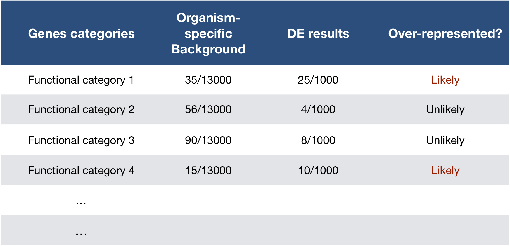

# Functional analysis 

The output of RNA-seq differential expression analysis is a list of significant differentially expressed genes (DEGs). To gain greater biological insight on the differentially expressed genes there are various analyses that can be done:

- determine whether there is enrichment of known biological functions, interactions, or pathways
- identify genes' involvement in novel pathways or networks by grouping genes together based on similar trends
- use global changes in gene expression by visualizing all genes being significantly up- or down-regulated in the context of external interaction data

Generally for any differential expression analysis, it is useful to interpret the resulting gene lists using freely available web- and R-based tools.  While tools for functional analysis span a wide variety of techniques, they can loosely be categorized into three main types: over-representation analysis, functional class scoring, and pathway topology [[1](https://github.com/hbctraining/In-depth-NGS-Data-Analysis-Course/raw/master/resources/pathway_tools.pdf)]. 

The goal of functional analysis is provide biological insight, so it's necessary to analyze our results in the context of our experimental hypothesis: **FMRP and MOV10 associate and regulate the translation of a subset of RNAs**. Therefore, based on the authors' hypothesis, we may expect the enrichment of processes/pathways related to **translation, splicing, and the regulation of mRNAs**, which we would need to validate experimentally.

***Note that all tools described below are great tools to validate experimental results and to make hypotheses. These tools suggest genes/pathways that may be involved with your condition of interest; however, you should NOT use these tools to make conclusions about the pathways involved in your experimental process. You will need to perform experimental validation of any suggested pathways.***

## Over-representation analysis

There are a plethora of functional enrichment tools that perform some type of "over-representation" analysis by querying databases containing information about gene function and interactions.

These databases typically **categorize genes into groups (gene sets)** based on shared function, or involvement in a pathway, or presence in a specific cellular location, or other categorizations, e.g. functional pathways, etc. Essentially, known genes are binned into categories that have been consistently named (controlled vocabulary) based on how the gene has been annotated functionally. These categories are independent of any organism, however each organism has distinct categorizations available.

To determine whether any categories are over-represented, you can determine the probability of having the observed proportion of genes associated with a specific category in your gene list based on the proportion of genes associated with the same category in the background set (gene categorizations for the appropriate organism). 

  

  

  
The statistical test that will determine whether something is actually over-represented is the *Hypergeometric test*.

### Hypergeometric testing

Using the example of the first functional category above, hypergeometric distribution is a probability distribution that describes the probability of 25 genes (k) being associated with "Functional category 1", for all genes in our gene list (n=1000), from a population of all of the genes in entire genome (N=13,000) which contains 35 genes (K) associated with "Functional category 1" [[2](https://en.wikipedia.org/wiki/Hypergeometric_distribution)].

The calculation of probability of k successes follows the formula:

  

This test will result in an adjusted p-value (after multiple test correction) for each category tested.

### Gene Ontology project

One of the most widely-used categorizations is the **Gene Ontology (GO)** established by the Gene Ontology project.

"The Gene Ontology project is a collaborative effort to address the need for consistent descriptions of gene products across databases" [[3](http://geneontology.org/page/introduction-go-resource)]. The [Gene Ontology Consortium](http://geneontology.org/page/go-consortium-contributors-list) maintains the GO terms, and these GO terms are incorporated into gene annotations in many of the popular repositories for animal, plant, and microbial genomes. 

Tools that investigate enrichment of biological functions or interactions often use the Gene Ontology (GO) categorizations, i.e. the GO terms to determine whether any have significantly modified representation in a given list of genes. Therefore, to best use and interpret the results from these functional analysis tools, it is helpful to have a good understanding of the GO terms themselves and their organization.

#### GO Ontologies

To describe the roles of genes and gene products, GO terms are organized into three independent controlled vocabularies (ontologies) in a species-independent manner: 

- **Biological process:** refers to the biological role involving the gene or gene product, and could include "transcription", "signal transduction", and "apoptosis". A biological process generally involves a chemical or physical change of the starting material or input.
- **Molecular function:** represents the biochemical activity of the gene product, such activities could include "ligand", "GTPase", and "transporter". 
- **Cellular component:** refers to the location in the cell of the gene product. Cellular components could include "nucleus", "lysosome", and "plasma membrane".

Each GO term has a term name (e.g. **DNA repair**) and a unique term accession number (**GO:0005125**), and a single gene product can be associated with many GO terms, since a single gene product "may function in several processes, contain domains that carry out diverse molecular functions, and participate in multiple alternative interactions with other proteins, organelles or locations in the cell" [[4](https://github.com/hbctraining/In-depth-NGS-Data-Analysis-Course/raw/master/resources/go_terms.pdf)]. 

#### GO term hierarchy

Some gene products are well-researched, with vast quantities of data available regarding their biological processes and functions. However, other gene products have very little data available about their roles in the cell. 

For example, the protein, "p53", would contain a wealth of information on it's roles in the cell, whereas another protein might only be known as a "membrane-bound protein" with no other information available. 

The GO ontologies were developed to describe and query biological knowledge with differing levels of information available. To do this, GO ontologies are loosely hierarchical, ranging from general, 'parent', terms to more specific, 'child' terms. The GO ontologies are "loosely" hierarchical since 'child' terms can have multiple 'parent' terms.

Some genes with less information may only be associated with general 'parent' terms or no terms at all, while other genes with a lot of information be associated with many terms.

[Tips for working with GO terms](http://journals.plos.org/ploscompbiol/article?id=10.1371/journal.pcbi.1003343)

### Visualizing clusterProfiler results
clusterProfiler has a variety of options for viewing the over-represented GO terms. We will explore the dotplot, enrichment plot, and the category netplot.

The **dotplot** shows the number of genes associated with the first 50 terms (size) and the p-adjusted values for these terms (color). This plot displays the top 50 GO terms by gene ratio (# genes related to GO term / total number of sig genes), not p-adjusted value.

 

 

The next plot is the **category netplot** shows the relationships between the genes associated with the top five most significant GO terms and the fold changes of the significant genes associated with these terms (color). The size of the GO terms reflects the pvalues of the terms, with the more significant terms being larger. This plot is particularly useful for hypothesis generation in identifying genes that may be important to several of the most affected processes. 

 

 
  
## Functional analysis using functional class scoring 

In addition to over-representation analysis, there are other types of analyses can be equally important or informative for obtaining some biological insight from your results. The **hypothesis behind functional class scoring (FCS) methods** is that although large changes in individual genes can have significant effects on pathways (and will be detected via ORA methods), **weaker but coordinated changes in sets of functionally related genes (i.e., pathways) can also have significant effect**s.  Thus, rather than setting an arbitrary threshold to identify 'significant genes', **all genes are considered** in the analysis. The gene-level statistics from the dataset are aggregated to generate a single pathway-level statistic and statistical significance of each pathway is reported. This type of analysis can be particularly helpful if the differential expression analysis only outputs a small list of significant DE genes. 

One commonly used tool which is classified under Functional class scoring (FCS), is [GSEA](https://www.pnas.org/content/102/43/15545). Gene set enrichment analysis utilizes the gene-level statistics or log2 fold changes for all genes to look to see whether gene sets for particular biological pathways are enriched among the large positive or negative fold changes. 

 

 
  
Gene sets are pre-defined groups of genes, which are functionally related. Commonly used gene sets include those derived from KEGG pathways, Gene Ontology terms, MSigDB, Reactome, or gene groups that share some other functional annotations, etc. [[1](../../resources/pathway_tools.pdf)]. 

The details regarding GSEA can be found in the [PNAS paper](https://www.pnas.org/content/102/43/15545) by Subramanian et al. We will describe briefly the steps outlined in the paper below:

 

_**Image credit:** [Subramanian et al. Proceedings of the National Academy of Sciences Oct 2005, 102 (43) 15545-15550; DOI: 10.1073/pnas.0506580102](https://www.pnas.org/content/102/43/15545)_

This image describes the theory of GSEA, with the 'gene set S' showing the metric used (in our case, ranked log2 fold changes) to determine enrichment of genes in the gene set. The left-most image is representing this metric used for the GSEA analysis. The log2 fold changes for each gene in the 'gene set S' is shown as a line in the middle image. The large positive log2 fold changes are at the top of the gene set image, while the largest negative log2 fold changes are at the bottom of the gene set image. In the right-most image, the gene set is turned horizontally, underneath which is an image depicting the calculations involved in determining enrichment, as described below.

**Step 1:** Calculation of enrichment score: 

An enrichment score for a particular gene set is calculated by walking down the list of log2 fold changes and increasing the running-sum statistic every time a gene in the gene set is encountered and decreasing it when genes are not part of the gene set. The size of the increase/decrease is determined by magnitude of the log2 fold change. Larger (positive or negative) log2 fold changes will result in larger increases or decreases. The final enrichment score is where the running-sum statistic is the largest deviation from zero.

**Step 2:** Estimation of significance:

The significance of the enrichment score is determined using permutation testing, which performs rearrangements of the data points to determine the likelihood of generating an enrichment score as large as the enrichment score calculated from the observed data. Essentially, for this step, the first permutation would reorder the log2 fold changes and randomly assign them to different genes, reorder the gene ranks based on these new log2 fold changes, and recalculate the enrichment score. The second permutation would reorder the log2 fold changes again and recalculate the enrichment score again, and this would continue for the total number of permutations run. Therefore, the number of permutations run will increase the confidence in the signficance estimates.

**Step 3:** Adjust for multiple test correction

After all gene sets are tested, the enrichment scores are normalized for the size of the gene set, then the p-values are corrected for multiple testing.

The GSEA output will yield the core genes in the gene sets that most highly contribute to the enrichment score. The genes output are generally the genes at or before the running sum reaches its maximum value (eg. the most influential genes driving the differences between conditions for that gene set).

### Incorpororating other gene sets for GSEA

There are other gene sets available for GSEA analysis in clusterProfiler (Disease Ontology, Reactome pathways, etc.). In addition, it is possible to supply your own gene set GMT file, and use that as input.

The Molecular Signatures Database (also known as [MSigDB](http://software.broadinstitute.org/gsea/msigdb/index.jsp)) is a collection of annotated gene sets. It contains 8 major collections:

* H: hallmark gene sets
* C1: positional gene sets
* C2: curated gene sets
* C3: motif gene sets
* C4: computational gene sets
* C5: GO gene sets
* C6: oncogenic signatures
* C7: immunologic signatures

Users can download GMT files from Broad Institute and use the read.gmt() function to parse the files. Alternatively, there is an R package that already packed the MSigDB gene sets in tidy data format that can be used directly with clusterProfiler.

## Other Tools for Functional Analysis

### Pathway topology tools

The last main type of functional analysis technique is pathway topology analysis. Pathway topology analysis often takes into account gene interaction information along with the fold changes and adjusted p-values from differential expression analysis to identify dysregulated pathways. Depending on the tool, pathway topology tools explore how genes interact with each other (e.g. activation, inhibition, phosphorylation, ubiquitination, etc.) to determine the pathway-level statistics. Pathway topology-based methods utilize the number and type of interactions between gene product (our DE genes) and other gene products to infer gene function or pathway association. 

For instance, the [SPIA (Signaling Pathway Impact Analysis)](http://bioconductor.org/packages/release/bioc/html/SPIA.html) tool can be used to integrate the lists of differentially expressed genes, their fold changes, and pathway topology to identify affected pathways. We have step-by-step materials for using SPIA [available](pathway_topology.md).

### Co-expression clustering

Co-expression clustering is often used to identify genes of novel pathways or networks by grouping genes together based on similar trends in expression. These tools are useful in identifying genes in a pathway, when their participation in a pathway and/or the pathway itself is unknown. These tools cluster genes with similar expression patterns to create 'modules' of co-expressed genes which often reflect functionally similar groups of genes. These 'modules' can then be compared across conditions or in a time-course experiment to identify any biologically relevant pathway or network information.

You can visualize co-expression clustering using heatmaps, which should be viewed as suggestive only; serious classification of genes needs better methods.  

The way the tools perform clustering is by taking the entire expression matrix and computing pair-wise co-expression values. A network is then generated from which we explore the topology to make inferences on gene co-regulation. The [WGCNA](https://horvath.genetics.ucla.edu/html/CoexpressionNetwork/Rpackages/WGCNA/) package (in R) is one example of a more sophisticated method for co-expression clustering.

## Resources for functional analysis

* g:Profiler - http://biit.cs.ut.ee/gprofiler/index.cgi 
* DAVID - https://david.ncifcrf.gov
* clusterProfiler - http://bioconductor.org/packages/release/bioc/html/clusterProfiler.html
* GeneMANIA - http://www.genemania.org/
* GenePattern -  http://www.broadinstitute.org/cancer/software/genepattern/ (need to register)
* WebGestalt - http://www.webgestalt.org (need to register)
* AmiGO - http://amigo.geneontology.org/amigo
* ReviGO (visualizing GO analysis, input is GO terms) - http://revigo.irb.hr/ 
* WGCNA - https://horvath.genetics.ucla.edu/html/CoexpressionNetwork/Rpackages/WGCNA/
* GSEA - http://software.broadinstitute.org/gsea/index.jsp
* SPIA - https://www.bioconductor.org/packages/release/bioc/html/SPIA.html
* GAGE/Pathview - http://www.bioconductor.org/packages/release/bioc/html/gage.html

***
*This lesson has been developed by members of the teaching team at the [Harvard Chan Bioinformatics Core (HBC)](http://bioinformatics.sph.harvard.edu/). These are open access materials distributed under the terms of the [Creative Commons Attribution license](https://creativecommons.org/licenses/by/4.0/) (CC BY 4.0), which permits unrestricted use, distribution, and reproduction in any medium, provided the original author and source are credited.*
